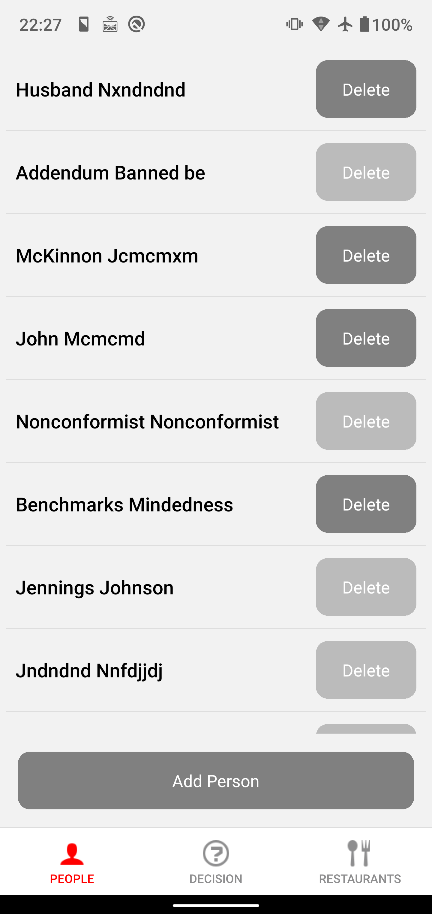

# Welcome Restaurant-Chooser App


# Clone & Run
```shell
git clone https://github.com/lichangjiang-up/restaurant-chooser.git
cd restaurant-chooser
npm install
npm run android
```


# Navigation 
```text
├── (tabs)
│   ├── (decision)
│   │   ├── _layout.tsx
│   │   ├── choice.tsx
│   │   ├── enjoy.tsx
│   │   ├── index.tsx
│   │   ├── pre_filters.tsx
│   │   └── who.tsx
│   ├── (people)
│   │   ├── _layout.tsx
│   │   ├── index.tsx
│   │   └── person.tsx
│   ├── (restaurants)
│   │   ├── _layout.tsx
│   │   ├── index.tsx
│   │   └── restaurant.tsx
│   └── _layout.tsx
├── +not-found.tsx
└── _layout.tsx
```

## [app/(tabs)/_layout.tsx](app/(tabs)/_layout.tsx)
**Bottom navigation bar**


## (decision)
### [app/(tabs)/(decision)/index.tsx](app/(tabs)/(decision)/index.tsx)
**Decision Index Page**

_On this page, clicking on the pictures or text will lead you to the page of app/(tabs)/(decision)/who.tsx._


### [app/(tabs)/(decision)/who.tsx](app/(tabs)/(decision)/who.tsx)

**Who's Going Page**

_On this page, you can select the people who will have meals._


### [app/(tabs)/(decision)/pre_filters.tsx](app/(tabs)/(decision)/pre_filters.tsx)

**Restaurant Filter Page**

* You can filter the restaurants that meet the conditions on this page.
* Click the "Next" button, and you will enter the page of `app/(tabs)/(decision)/choice.tsx`.


### [app/(tabs)/(decision)/choice.tsx](app/(tabs)/(decision)/choice.tsx)

**Choice Screen**


**Clicking the button will randomly pop up information about a restaurant:**


**If you click "Veto", it will display the "Vetoed People" list:**


**After selecting and clicking the "Save" button, you will see that the original "People" list now shows those who have chosen "Veto".**


**In order to obtain a restaurant that satisfies everyone, you continued to click the 'Randomly Choice' button:**


**All of you are quite satisfied with this restaurant. You clicked the 'Accept' button and then entered the `app/(tabs)/(decision)/enjoy.tsx` page.**


### [app/(tabs)/(decision)/enjoy.tsx](app/(tabs)/(decision)/enjoy.tsx)

**Enjoy Page**


## (people) 

### app/(tabs)/(people)/index.tsx

**People Index Page**

* You can click the "Add" button to add a jump to the [Person](#app--tabs----people--persontsx) page and add a Person.
* You can click the Delete button to remove a Person. If someone is selected by Who's Going Page, they **`cannot`** be **deleted**.
* You can click on a Person Item to jump to page [Person](#app--tabs----people--persontsx) for update.




### [app/(tabs)/(people)/person.tsx](app/(tabs)/(people)/person.tsx)

**Person Edit or Create Page**

